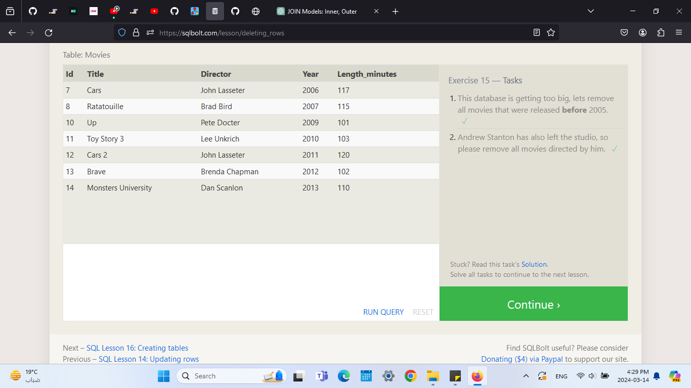

# summary:
## relational databases:
is a database type that use rows and columns to organize date forming tables.
these data tables can be joined together via primary keys moreover these primary keys ensure data integrity 

## SQL :
  SQL is a language used to interact with relational databases.
  It allows users to perform various operations on the database, such as querying, inserting, updating, and deleting data.
  SQL queries are written using specific syntax and keywords to retrieve or manipulate data from tables.
  Common SQL commands include SELECT (for querying), INSERT (for inserting new data), UPDATE (for updating existing data), DELETE (for deleting data), and more.
  SQL also supports data manipulation functions, aggregation functions, sorting, filtering, and joining tables.
  SQL provides flexibility and power in managing and analyzing relational data efficiently.

## screenshots

