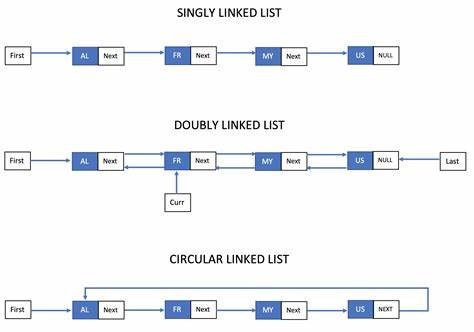

# Linked List:

to amintain a data in programming into an array you have two ways:
- Array List
- Linked List

Linked List:
A linked list is a linear data structure consisting of a sequence of elements, called nodes, where each node contains a reference (or pointer) to the next node in the sequence. Each node in a linked list consists of two parts: the data part, which stores the actual element, and the reference part, which points to the next node in the sequence.

Linked List advantage:
- Deleting and inserting items at certain index is more efficent than Array List >> O(1)
- Unlike arrays linked lists do not have a fixed size, and memory for elements is allocated dynamically as the list grows.(more momery-friendly)
- but Linked List is bad at searching >> O(n)

Linked List types:

### singly Linked List
A single linked list is a list made up of nodes that consist of two part 
- data >> contain the actual data
- link >> contain the address of next node of the list

- forward navigation (from head to tail)
### doubly Linked List
- has two address, one point to the next node and the other point to the previous
- consume more meromy due to the double address featur compare to singly Linked List
- forward navigation and backward (from head to tail and from tail to head)
### circular Linked List
- last element (the tail) is linked to the first one (the head)

