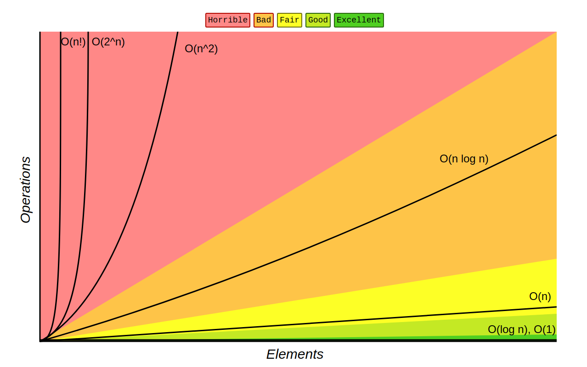

### Readings: Whitboarding + Big O

**Algorithm:**
 an algorithm is a step-by-step procedure or set of rules for solving a problem or accomplishing a task. it's like a recipe that tells you exactly what to do in order to achieve a specific outcome. Algorithm are used in various fields, including **math**, **computer science**, and **everyday life**.
Ex: An algorithm to add two numbers:

1- Take two number inputs  

2- Add numbers using the + operator 

3- Display the result 

# ______________________________________________________________________
in programming we do not care only about writing Algorithm and test whether this Algorithm give us the desire output or how easy to implement.!!
So what other factors that we might consider when it comes to writing an Algorithm ??

## Efficient
#### Time Complexity
- is a measure of how the runtime of an algorithm increases with the **size of the input**.
#### Space Complexity
- refers to the amount of memory an algorithm requires to excute in relation to the **size of the input**.

How can we compute the time complexity?

**1-** you literally Run algorithm on real machine along with timer and see how much does it takes to excute.

But is this approach good enough to give me a **bias free/reliable** results and why??

No, it's not ideal for Asymptotic Analysis for the following reasons:
- **Hardware Dependence:** The runtime of an algorithm can vary significantly depending on the hardware it runs on. Factors like processor speed, memory bandwidth, and cache size can all influence the observed runtime. This makes it difficult to generalize the performance of an algorithm across different computing environments.
- **Constant Factors:** Big O notation focuses on the growth rate of an algorithm's runtime as the input size increases. It abstracts away constant factors and lower-order terms, which may not be accurately captured through empirical runtime measurements. Thus, relying solely on runtime measurements may lead to inaccurate assessments of an algorithm's complexity class.
- **Infeasibility for Large Inputs:** Some algorithms have runtime complexities that grow exponentially or factorially with the input size. Testing such algorithms on large inputs may be infeasible due to time and resource constraints. In such cases, theoretical analysis based on algorithmic properties is essential for determining their complexity classes.
- **Algorithmic Insights:** Big O notation provides a high-level understanding of an algorithm's performance characteristics, independent of specific implementation details or hardware configurations. It allows developers to compare algorithms and make informed decisions about which ones to use in different scenarios.

**2- Frequency count method:**
The frequency count method is a technique used in **asymptotic analysis** to determine the time complexity of an algorithm based on the count of basic operations executed as a function of the input size. It involves counting the number of times certain operations are performed within the algorithm and expressing this count as a function of the input size.
Asymptotic Analysis (Notations) is an example of Frequency count method

# ______________________________________________________________________

## Asymptotic Analysis:
is a method to describe how good the performance of algorithm is, and basically it include the :

- **(Big O)-Notation:** 'worst case scenario' - Maximum time required for program execution.
- **(Big Omega)-Notation:** 'best case' - Minimum time required for program execution .
- **(Big Theta)-Notation:** 'average case' - Average time required for program execution .

# (Big O)-Notation:
- used to measure the performance of any algorithm 
- By providing the **order of the growth** of the function
- it gives the **upper bound** on a function (worst case)

what do we mean by upper bound??
- f(n) = 6n^2 + 100n + 300    >>>> the upper bound is >>>> O(n^2)
- f(n) = 11n^2 + 45n + 700    >>>> the upper bound is >>>> O(n^2)
- f(n) = 3n^3 7n^2 + 33n + 67 >>>> the upper bound is >>>> O(n^3)
- f(n) = 4log2(n) + 40        >>>> the upper bound is >>>> O(log2(n))

lower bound and constants are **neglected** 

### Rates of Growth:
| Notation    | Type         | Example                            | Description                                                  |
|-------------|--------------|------------------------------------|--------------------------------------------------------------|
| O(1)        | Constant     | Hash table access                  | Remain constant regardless of the size of the data set      |
| O(logn)     | Logarithmic  | Binary search of a sorted table    | Increase by a constant if n doubles, then time to perform increases by a constant smaller than n amount |
| O(<n)       | Sublinear    | Search using parallel processing   | Performs at less than linear and more than logarithmic level |
| O(n)        | Linear       | Finding an item in an unsorted list| Increases in proportion to n, if n doubles, the time to perform doubles |
| O(nlog(n))  | nlog(n)      | Quicksort, merge sort              | Increases at multiple of a constant                          |
| O(n^2)      | Quadratic    | Bubble sort                        | Increases in proportion to the product of n * n              |
| O(C^n)      | Exponential  | Travelling salesman problem solved using dynamic programming| Increases based on the exponent n of a constant c |
| O(n!)       | Factorial    | Travelling salesman problem solved using Brute Force | Increases in proportion to the product of all numbers included (e.g., 1 * 2 * 3 * 4) |

## Examples:

write a function to tell if array is empty or not and figure out the time complexity.

    def is_empty(arr):
      if len(arr) == 0:
        return True
      else:
        return False

looking at the function algorithm you can see that the instructions excution does not depend on the input size, whether you input a list that has 2 items or 1000 items, the alogrithm will excute the same frequency of instructions excution for differnet cases.

time complexity is Constant, O(1)

# ______________________________________________________________________

write a function to tell if a numbers in a list is even or odd and figure out the time complexity.

    def is_even(arr):
      for number in arr:
        if mod(number) == 0:
          print('Even')
        else:
          print('Odd') 

the time complexity is affected by the input size. because the an arr input with 10 items will have different frequency of instructions excution from an arr input with 50 items. 

time complexity is Linear, O(3n) >> 3 comes from the instructions inside the for loop and we said that we care only about the upper bound >> O(n)

# ______________________________________________________________________

    for i in range(x):
      for j in range(y):
        'do something'

the time complexity for a loop inside another loop is increase in proportion to the product of n*n >>  Quadratic O(n^2)

# ______________________________________________________________________

general rule for coputing the time complexity:
- consider the worst case (Big O)
- Remove constants
- drop the non-dominant terms, only consider upper bound
- different input gives differnt variables ?!
    def function(arr_1,arr_2):
      for i in arr_1:
        print(i)
      for j in arr_2:
        print(j)

what is the time complexity ??
first it's not n^2 because the two four loop not inside each other
is it possible to be 2n ?? No it's not 2n because the arr_1 and arr_2 not are the same they might have differnt length so the time complexity is >>  O(n + k)

what is the time complexity for a loop inside a loop with different input ??

# ______________________________________________________________________

# whitebording
